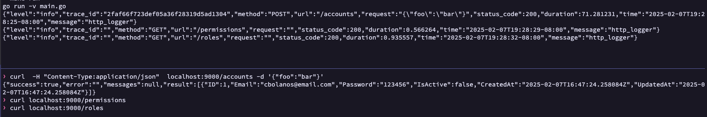
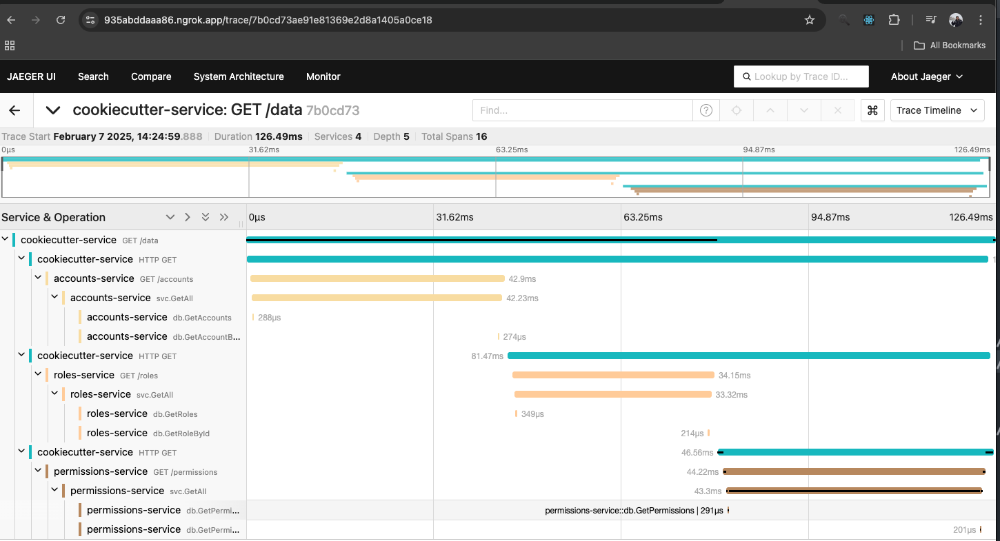
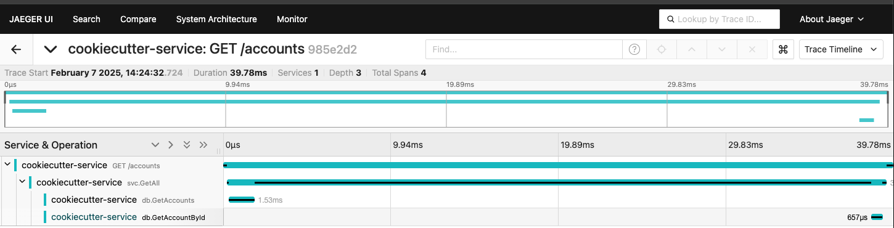

# About

This project is a [Cookiecutter](https://github.com/cookiecutter/cookiecutter) template for quickly spinning up a Go microservice using the following libraries.

- Mux (Routing)
- PGX (PostgreSQL Driver)
- Otel (Telemetry)
- Zerolog (Logging)

## Pending

- GH Actions
- app.yaml (multi env) + vault

## Getting Started

### Prequisites

- Cookiecutter
- Go
- Docker
- Golangci-lint
- Go Migrate

### Creating a new project

1.) From the root of your project workspaces, run:

```
cookiecutter git@github.com:bolanosdev/cookiecutter-go-mux.git
```

2.) Follow the prompts - if you're just trying it out, just use the defaults. For more info, see Project Options below.

```
$ group_name [company.com]
$ project_descriptionname [example_service]:
$ project_description [A brief overview of your service.]:
$ go_module [company.com/example-service]:
$ go_version [1.23]:
$ docker_base_image [gcr.io/distroless/base]:
$ namespace [default]:
```

3.) Change directories to the project that was created and run the following:

3.1) Install Dependencies

```
go mod tidy
go mod vendor
```

3.2) Create database and run initial migrations

```
make postgres -- creates databse server
make create_db -- creates database
make migrate_up -- run migrations from the db/migrations folder

```

3.3) Run project

```
make run OR `make build && docker-compose up
```

4.) The application and e2e test should exit successfully.

### Project Options

| Option              | Details                                                                                                      |
| ------------------- | ------------------------------------------------------------------------------------------------------------ |
| project_name        | This is the name of your project. If you use multiple words, make it spinal-case. (e.g. example-service)     |
| project_description | This is a description of your project - short and sweet works here.                                          |
| go_module           | This is the go module. This will be auto-generated from your project name and project slug.                  |
| go_version          | This is the version of Go we want to use. Defaults to 1.15.                                                  |
| docker_image        | This is the base docker image to use when creating the project (excluding the hostname). Defaults to buster. |
| namespace           | The Kubernetes namespace                                                                                     |

The app also comes with a couple of http handlers, services and sql migrations/operations examples, feel free to clean up the code as you needed.

## Database

Upon creating your database <a href="https://github.com/bolanosdev/cookiecutter-go-mux/blob/main/README.md#creating-a-new-project">(step 3.2)</a>, make sure the credentials are properly set in the app.yaml db section.

To learn how to create additional migrations refer to <a href="https://github.com/golang-migrate/migrate/blob/master/database/postgres/TUTORIAL.md" target="_blank">golang-migrate documentation</a>

Once you have the database setup the way you wanted with your migrations, go ahead and create as many functions you want on the <a href="https://github.com/bolanosdev/cookiecutter-go-mux/blob/main/%7B%7B%20cookiecutter.project_name%20%7D%7D/db/sql/accounts.go#L13">sql</a> folder to perform db operations.

We decided to write our DB models/operations instead of using a sql generator such as <a href="https://github.com/sqlc-dev/sqlc">sqlc</a>, but feel free to add it if you want, that is why we follow similar folder structure.

## Logging

You can use any logging library you want, we just configured a <a href="https://github.com/bolanosdev/cookiecutter-go-mux/blob/main/%7B%7B%20cookiecutter.project_name%20%7D%7D/cmd/middleware/logging.go" target="_blank">logging middleware</a> to write some statistics of each request http_logger: {timestamp, uri, status_code, request, trace_id, duration}.

Notes:

- The trace_id should match the parent jaeger trace_id
- If you want to exclude routes you can add them to the app.yaml observability ignored_paths list.
- If you want the request body to not be included on the request you can add it to the app.yaml observability.sensitive_paths list. (do this if you do not want your logs to include sensitive information)

<p>
  Example: <br/>
</p>

## Telemetry

### Prometheus

The project comes with a /metrics endpoint supported thanks to <a href="https://github.com/labbsr0x/mux-monitor" target="blank">Mux Monitor</a>

### Jaeger

The project comes with telemetry enabled for internal use and across multiple services.
as long as you set the observability.jaeger.dial_hostname to a running instance of jaeger.

1. Registering http events.
   see app.go router how I'm using utils.Instrument to attach otelhttp middleware to the mux routes.
2. Registering child events using parent traces.
   See how I'm using utils.TraceWithContext on <a href="https://github.com/bolanosdev/cookiecutter-go-mux/blob/main/%7B%7B%20cookiecutter.project_name%20%7D%7D/internal/services/accounts.go#L22C1-L23C1" target="_blank" />internal/services/accounts</a> or <a href="https://github.com/bolanosdev/cookiecutter-go-mux/blob/main/%7B%7B%20cookiecutter.project_name%20%7D%7D/db/sql/accounts.go#L13" target="_blank">db/sql/accounts</a>, to append new child traces.
   
3. Registering upstream events.
   You can create 2 apps using the template and call app B from app B in the <a href="https://github.com/bolanosdev/cookiecutter-go-mux/blob/main/%7B%7B%20cookiecutter.project_name%20%7D%7D/internal/api/data.go#L27" target="_blank">internal/api/data.go handler</a>
   you will see in jaeger how the child app is already picking up the parent_trace from the event context propagator.
   
