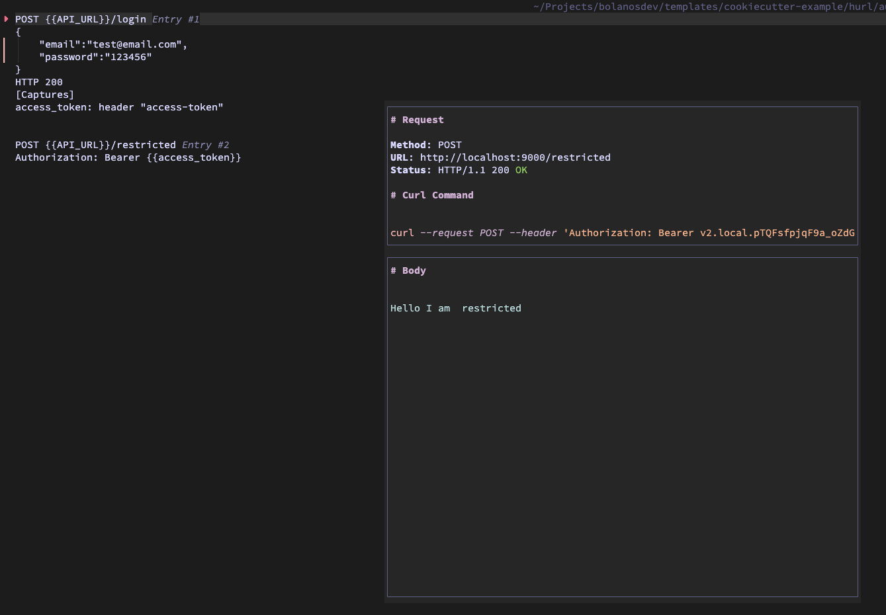
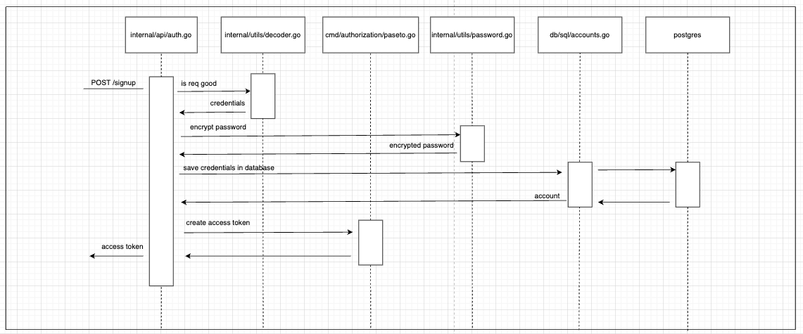
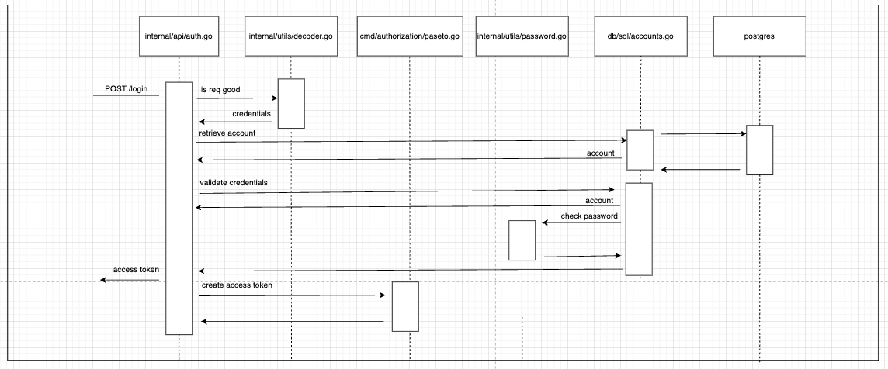

# About

This project is a [Cookiecutter](https://github.com/cookiecutter/cookiecutter) template for quickly spinning up a Go microservice using the following libraries.

- Mux (Routing)
- PGX (PostgreSQL Driver)
- Otel (Telemetry)
- Zerolog (Logging)

## Pending

- GH Actions
- app.yaml (multi env) + vault

## Getting Started

### Prequisites

- Cookiecutter
- Go
- Docker
- Golangci-lint
- Go Migrate

### Creating a new project

1.) From the root of your project workspaces, run:

```
cookiecutter git@github.com:bolanosdev/cookiecutter-go-mux.git
```

2.) Follow the prompts - if you're just trying it out, just use the defaults. For more info, see Project Options below.

```
$ group_name [company.com]
$ project_descriptionname [example_service]:
$ project_description [A brief overview of your service.]:
$ go_module [company.com/example-service]:
$ go_version [1.23]:
$ docker_base_image [gcr.io/distroless/base]:
$ namespace [default]:
```

3.) Change directories to the project that was created and run the following:

3.1) Install Dependencies

```
go mod tidy
go mod vendor
```

3.2) Create infrastructure using docker-compose

```
docker-compose up -d
```

3.3) Run initial migrations

```
task dev:migrate_up

```

3.4) Run project
Run the project using the included launch.json or through the terminal

```
task dev:run
```


### Project Options

| Option              | Details                                                                                                      |
| ------------------- | ------------------------------------------------------------------------------------------------------------ |
| service_name        | This is the name of your project. If you use multiple words, make it spinal-case. (e.g. example-service)     |
| project_description | This is a description of your project - short and sweet works here.                                          |
| go_module           | This is the go module. This will be auto-generated from your project name and project slug.                  |
| go_version          | This is the version of Go we want to use. Defaults to 1.15.                                                  |
| docker_image        | This is the base docker image to use when creating the project (excluding the hostname). Defaults to gcr.io/distroless/base. |

The app also comes with a couple of http handlers, services and sql migrations/operations examples, feel free to clean up the code as you needed.

## Database

Upon creating your database <a href="https://github.com/bolanosdev/cookiecutter-go-mux/blob/main/README.md#creating-a-new-project">(step 3.2)</a>, make sure the credentials are properly set in the app.yaml db section.

To learn how to create additional migrations refer to <a href="https://github.com/golang-migrate/migrate/blob/master/database/postgres/TUTORIAL.md" target="_blank">golang-migrate documentation</a>

Once you have the database setup the way you wanted with your migrations, go ahead and create as many functions you want on the <a href="https://github.com/bolanosdev/cookiecutter-go-mux/blob/main/%7B%7B%20cookiecutter.service_name%20%7D%7D/db/sql/accounts_store.go#L13">sql</a> folder to perform db operations.

We decided to write our DB models/operations instead of using a sql generator such as <a href="https://github.com/sqlc-dev/sqlc">sqlc</a>, but feel free to add it if you want, that is why we follow similar folder structure.


## Logging

You can use any logging library you want, we added a custom logging middleware, <a href="https://github.com/bolanosdev/cookiecutter-go-mux/blob/main/%7B%7B%20cookiecutter.service_name%20%7D%7D/service/middleware/logger.go" target="_blank">logging middleware</a> to write some basic statistics of each request http_logger: {timestamp, uri, status_code, request, trace_id, duration}, and a <a href="https://github.com/bolanosdev/cookiecutter-go-mux/blob/main/%7B%7B%20cookiecutter.service_name%20%7D%7D/service/handlers/handlers.go">Error Handler</a> to catch/log and report errors to sentry.

Notes:

- The every log should also include a jaeger trace_id and sentry event_id.
- If you want to exclude routes you can add them to the app.yaml observability ignored_paths list.

<p>
  Example: <br/>
</p>

## Telemetry

### Tracing
we added a Jaeger middleware to register http events and custom methods to register child events for business logic (services) and database operations (stores), additionally. jaeger is configured to persist the trace_id through downstream services.

### Prometheus

The project comes with a custom /metrics endpoint supported thanks to <a href="https://github.com/bolanosdev/prometheus-mux-monitor" target="blank">Prometheus Mux Monitor</a>


### Authorization

The template comes with a basic route authorization based on paseto tokens, see how you can create/retrieve tokens on the <a hred="https://github.com/bolanosdev/cookiecutter-go-mux/blob/main/%7B%7B%20cookiecutter.service_name%20%7D%7D/service/middleware/authorization.go" target="_blank">/login /signup endpoints on the internal/api/auth.go</a>

And how you can restrict access to http.Handler(s) using the middleware.Authorization look at the <a href="https://github.com/bolanosdev/cookiecutter-go-mux/blob/main/%7B%7B%20cookiecutter.service_name%20%7D%7D/cmd/app.router.go#L32" target="_blank">/restricted endpoint in cmd/app_router.go</a>

Example of an authorized Request


Sequence diagram on how the Access-Token is generated on /signup


Sequence diagram on how the Access-Token is generated on /login

